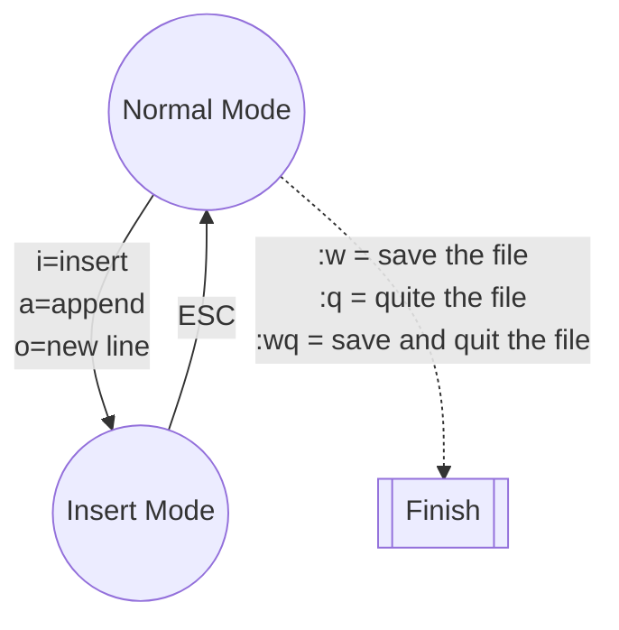

# VIM - Vi Improved

## 1. 常用

## 2. Normal Mode

### 2-1. 移動游標

|          按鍵           |                  移動游標的方式                   |
| :---------------------: | :-----------------------------------------------: |
|    `l` 或是 向右箭頭    |                  往右移一個字元                   |
|    `h` 或是 向左箭頭    |                  往左移一個字元                   |
|    `j` 或是 向下箭頭    |                     往下一行                      |
|    `k` 或是 向上箭頭    |                     往上一行                      |
|           `0`           |               移至目前該行的最前端                |
|           `^`           |            移至該行的第一個非空白字元             |
|           `$`           |               移至目前該行的最後面                |
|           `w`           |          移至下一個字或是標點符號的字首           |
|           `W`           |         移至下一個字的字首，忽略標點符號          |
|           `b`           |          移至前一個字或是標點符號的字首           |
|           `B`           |         移至前一個字的字首，忽略標點符號          |
| `Ctrl-F` 或 `Page Down` |                     往下一頁                      |
|  `Ctrl-B` 或 `Page Up`  |                     往上一頁                      |
|       `數字`+`G`        | 移至 `數字` 行，例如，`1G` 會移動到該檔案的第一行 |
|           `G`           |               移至該檔案的最後一行                |

### 2-2. 基本編輯

#### 2-2-1. 附加文字

`a` ：移動到行尾後一個字元的位置，並且進入新增模式。

#### 2-2-2. 打開一行

| 指令 |                開啟方式                |
| :--: | :------------------------------------: |
| `o`  | 在目前該行的下方開啟一行並進入新增模式 |
| `O`  | 在目前該行的上方開啟一行並進入新增模式 |

#### 2-2-3. 刪除文字

|  指令  |                 刪除的動作                 |
| :----: | :----------------------------------------: |
|  `x`   |                 目前的字元                 |
|  `3x`  |         目前的字元和之後的兩個字元         |
|  `dd`  |                 目前這一行                 |
| `5dd`  |         目前這一 行和接下來的四行          |
|  `dW`  |      從現在的游標位置到下一個字的開頭      |
|  `d$`  |       從現在的游標位置到這一行的尾端       |
|  `d0`  |       從現在的游標位置到這一行的開頭       |
|  `d^`  | 從現在的游標位置到這一行的第一個非空白字元 |
|  `dG`  |          從現在這一行到檔案的結尾          |
| `d20G` |        從現在這一行到檔案的第 20 行        |

#### 2-2-4. 剪下、複製和貼上文字

|  指令  |                 複製的動作                 |
| :----: | :----------------------------------------: |
|  `yy`  |                 目前這一行                 |
| `3yy`  |          目前這一行和接下來的兩行          |
|  `yW`  |      從現在的游標位置到下一個字的開頭      |
|  `y$`  |       從現在的游標位置到這一行的尾端       |
|  `y0`  |       從現在的游標位置到這一行的開頭       |
|  `y^`  | 從現在的游標位置到這一行的第一個非空白字元 |
|  `yG`  |          從現在這一行到檔案的結尾          |
| `y20G` |        從現在這一行到檔案的第 20 行        |

`p` ：將複製的那一行貼到目前該行的下方。
